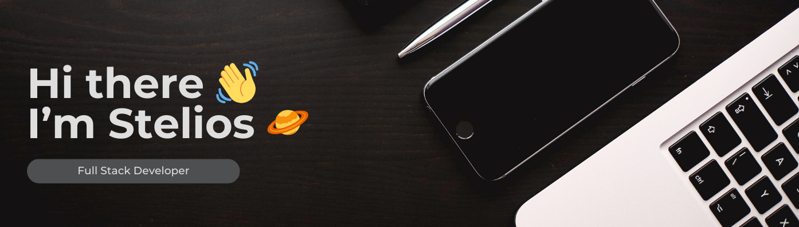
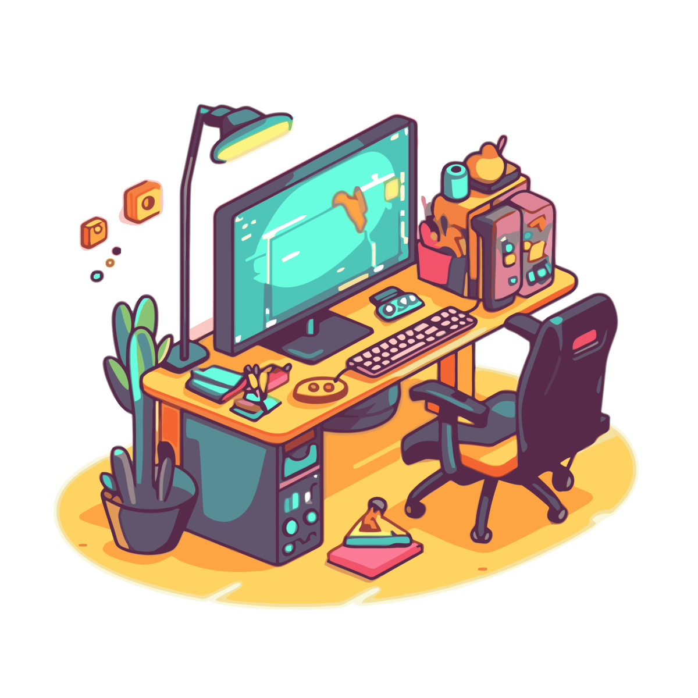
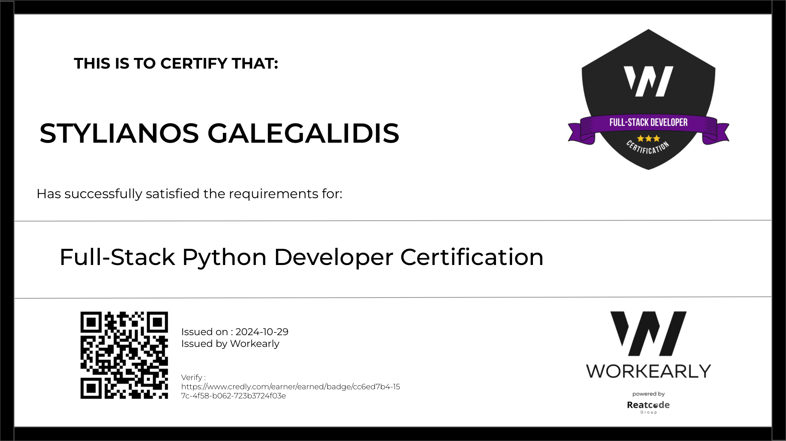

I'm a **full stack developer** passionate about:

🌟 Making open-source more accessible.  
🌟 Building technology to empower people.  
🌟 Fostering strong and inclusive communities.

## 🥐 About Me

<table style="width: 100%, border: none;, flex-wrap: no-wrap;">
  <tr>
    <td>
      <ul>
        <li>🌱 I’m currently working on <b>Interview Simulation</b></li>
        <li>🐛 I'm Currently creating <b>unique bugs.</b></li>
        <li>🤝 I’m looking to <b>collaborate on projects</b></li>
        <li>🎮 I love playing <b>video games</b> and <b>watching movies.</b></li>
        <li>🔪 <b>Tabs</b> over spaces.</li>
      </ul>
    </td>
    <td>
      
    </td>
  </tr>
</table>

## 🚀 Languages and Tools

## 📊 GitHub Stats

    &nbsp;&nbsp;
    &nbsp;&nbsp;

## 🏆 Achievements

**Full Stack Dev Cerification** at [**Workearly**](https://www.workearly.gr)
 

## 📬 Contact

Let's connect and build something!  
📧 **Email:** [stelios.galegalidis@gmail.com](mailto:stelios.galegalidis@gmail.com)  
💼 **LinkedIn:** [Stelios Galegalidis](https://www.linkedin.com/in/stelios-galegalidis-59b448220/)

